# 3D Floor Plan Converter - System Architecture

## Complete Data & Processing Pipeline

```mermaid
flowchart TD
    subgraph input["🔹 INPUT LAYER"]
        A["JSON Floor Plan<br/>(2D Coordinates)"]
        B["Room Metadata<br/>(Type, Area, etc)"]
        C["User Configuration<br/>(Colors, Thickness)"]
    end
    
    subgraph validation["🔹 VALIDATION LAYER"]
        D["Structure Validation<br/>• Check walls key<br/>• Validate coordinates"]
        E["Room Data Parsing<br/>• Extract room types<br/>• Calculate areas"]
        F["Color & Parameter<br/>Validation"]
    end
    
    subgraph processing["🔹 GEOMETRY PROCESSING ENGINE"]
        G["Line Buffering<br/>(Shapely)<br/>1D → 2D Polygons"]
        H["Wall Extrusion<br/>(Trimesh)<br/>2D → 3D Meshes"]
        I["Floor Generation<br/>Bounding Box +<br/>Union Operations"]
        J["Room Color<br/>Management<br/>Type → RGB Mapping"]
    end
    
    subgraph assembly["🔹 SCENE ASSEMBLY"]
        K["Combine Geometries<br/>• Merge wall meshes<br/>• Add floor plane"]
        L["Apply Colors &<br/>Materials<br/>Room-type mapping"]
        M["Create 3D Scene<br/>(Trimesh.Scene)"]
    end
    
    subgraph export["🔹 EXPORT LAYER"]
        N["GLB Export<br/>(Binary Format)"]
        O["Generate Metadata<br/>Room info, stats"]
    end
    
    subgraph output["🔹 OUTPUT"]
        P["3D Model File<br/>(GLB)"]
        Q["Room Analysis<br/>Summary"]
        R["3D Viewer Preview<br/>(Web Interface)"]
    end
    
    A --> D
    B --> E
    C --> F
    
    D --> G
    E --> J
    F --> H
    
    G --> H
    H --> I
    I --> K
    J --> L
    
    K --> M
    L --> M
    
    M --> N
    M --> O
    
    N --> P
    O --> Q
    P --> R
    Q --> R
    
    style input fill:#e1f5ff,stroke:#01579b,stroke-width:2px
    style validation fill:#fff3e0,stroke:#e65100,stroke-width:2px
    style processing fill:#f3e5f5,stroke:#4a148c,stroke-width:2px
    style assembly fill:#e8f5e9,stroke:#1b5e20,stroke-width:2px
    style export fill:#fce4ec,stroke:#880e4f,stroke-width:2px
    style output fill:#f1f8e9,stroke:#33691e,stroke-width:2px
```



---

## Component Interaction & Class Structure

```mermaid
flowchart LR
    subgraph web["WEB INTERFACE<br/>(Gradio UI)"]
        WEB["🖥️ Web Application<br/>• File upload<br/>• Template selector<br/>• Color picker<br/>• 3D viewer"]
    end
    
    subgraph core["CORE ENGINE (Python)"]
        HB["🔧 HouseBuilder<br/>• process_floorplan()<br/>• export_to_glb()<br/>• set_room_colors()"]
        RCM["🎨 RoomColorManager<br/>• get_color()<br/>• set_custom_colors()<br/>• get_all_colors()"]
        GEOM["📐 Geometry Operations<br/>• _create_wall_polygon()<br/>• _extrude_wall()<br/>• _create_floor()"]
    end
    
    subgraph deps["EXTERNAL LIBRARIES"]
        SHAPELY["Shapely<br/>(2D Geometry)<br/>LineString, Polygon<br/>buffer, union"]
        TRIMESH["Trimesh<br/>(3D Mesh)<br/>Mesh, Scene<br/>extrude_polygon"]
        NUMPY["NumPy<br/>(Numerical)<br/>Arrays, Math"]
        EARCUT["Mapbox Earcut<br/>(Triangulation)<br/>Polygon → Triangles"]
    end
    
    subgraph output["OUTPUT"]
        GLB["📦 GLB File<br/>(Binary 3D Format)"]
        STATS["📊 Room Statistics<br/>Area, Dimensions<br/>Position, Type"]
    end
    
    WEB -->|"JSON Data"| HB
    WEB -->|"Custom Colors"| RCM
    HB -->|"Uses"| RCM
    HB -->|"Calls"| GEOM
    
    GEOM -->|"Uses"| SHAPELY
    GEOM -->|"Uses"| TRIMESH
    GEOM -->|"Uses"| NUMPY
    TRIMESH -->|"Uses"| EARCUT
    
    HB -->|"Exports"| GLB
    HB -->|"Generates"| STATS
    
    style web fill:#bbdefb,stroke:#1565c0,stroke-width:2px
    style core fill:#c8e6c9,stroke:#2e7d32,stroke-width:2px
    style deps fill:#ffe0b2,stroke:#e65100,stroke-width:2px
    style output fill:#f8bbd0,stroke:#c2185b,stroke-width:2px
```



---

## Geometric Transformation Pipeline


---

## Performance Analysis & Optimization Opportunities


---

## System Class Hierarchy

```mermaid
flowchart TD
    subgraph classes["PYTHON CLASSES"]
        HB["HouseBuilder<br/>━━━━━━━━━━━━━<br/>Constructor:<br/>• wall_thickness<br/>• wall_height<br/>• floor_offset<br/>• custom_colors<br/>━━━━━━━━━━━━━<br/>Methods:<br/>• process_floorplan()<br/>• export_to_glb()<br/>• set_room_colors()<br/>• get_room_summary()"]
        
        RCM["RoomColorManager<br/>━━━━━━━━━━━━━<br/>Constructor:<br/>• custom_colors<br/>━━━━━━━━━━━━━<br/>Methods:<br/>• get_color(room_type)<br/>• set_custom_colors()<br/>• get_all_colors()"]
    end
    
    subgraph dependencies["DEPENDENCIES"]
        TRIM["Trimesh<br/>━━━━━━━━━━━━━<br/>• Scene<br/>• Mesh<br/>• extrude_polygon()"]
        
        SHAP["Shapely<br/>━━━━━━━━━━━━━<br/>• LineString<br/>• Polygon<br/>• buffer()<br/>• unary_union()"]
        
        NP["NumPy<br/>━━━━━━━━━━━━━<br/>• Arrays<br/>• Matrix operations<br/>• Math functions"]
        
        EC["Mapbox Earcut<br/>━━━━━━━━━━━━━<br/>• triangulate()"]
    end
    
    HB -->|"Uses"| RCM
    HB -->|"Uses"| TRIM
    HB -->|"Uses"| SHAP
    HB -->|"Uses"| NP
    
    TRIM -->|"Uses"| EC
    SHAP -->|"Uses"| NP
    
    style HB fill:#c8e6c9,stroke:#2e7d32,stroke-width:2px
    style RCM fill:#c8e6c9,stroke:#2e7d32,stroke-width:2px
    style TRIM fill:#ffe0b2,stroke:#e65100,stroke-width:2px
    style SHAP fill:#ffe0b2,stroke:#e65100,stroke-width:2px
    style NP fill:#ffe0b2,stroke:#e65100,stroke-width:2px
    style EC fill:#ffe0b2,stroke:#e65100,stroke-width:2px
```



---

## Data Flow Diagram


---

## Error Handling & Validation Flow


---

## Architecture Summary

| Layer | Component | Technology | Purpose |
|-------|-----------|-----------|---------|
| **Input** | User Interface | Gradio | File upload, configuration |
| **Validation** | Validator | Python | Structure & data checking |
| **Processing** | HouseBuilder | Shapely, Trimesh | 2D to 3D conversion |
| **Coloring** | RoomColorManager | Python, NumPy | Room type to color mapping |
| **Assembly** | Scene Manager | Trimesh | Geometry combination |
| **Export** | GLB Exporter | Trimesh | Binary format output |
| **Output** | Web Viewer | Three.js | 3D visualization |

---

## Key Design Principles

### 1. **Separation of Concerns**
- Validation logic isolated from geometry processing
- Color management independent of mesh generation
- UI completely separated from core engine

### 2. **Type Safety**
- All methods use Python type hints
- Clear input/output contracts
- IDE support for development

### 3. **Error Handling**
- Comprehensive try-catch blocks
- User-friendly error messages
- Context-aware error reporting

### 4. **Scalability**
- O(n) time complexity (linear scaling)
- Independent wall processing (parallelizable)
- Efficient memory usage

### 5. **Maintainability**
- Well-documented code
- Clear method names
- Logical class structure

---

## Technology Stack

```
Frontend:
├── Gradio (Web UI Framework)
├── Three.js (3D Viewer)
└── JavaScript/HTML/CSS

Backend:
├── Python 3.10+
├── Shapely (2D Geometry)
├── Trimesh (3D Meshes)
├── NumPy (Numerical Ops)
├── Mapbox Earcut (Triangulation)
└── PIL (Image Processing)

Format:
└── GLB (OpenGL Transmission Format)
    ├── Binary format
    ├── Mesh data
    ├── Colors
    └── Universal compatibility
```

---

Generated: November 29, 2025  
Version: 2.0  
Status: Production Ready
